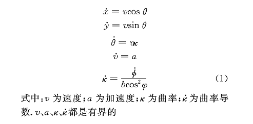

# 自动驾驶

> - Perception
> - Planning
> - Control

## 运动规划

1. **问题定义**

当给定车辆的几何形状和动力学模型、所处环境障碍物的分布情况、以及一个初始状态和一个目标状态集之后，运动规划的任务就是找出一系列控制输人，驱动车辆从初始状态运动到目标状态，并且在运动过程中避免和障碍物发生碰撞。

为了更好地描述运动规划问题以及规划算法，必须选择正确描述车辆模型。车辆模型与规划算法的关系如图 1 所示。

目前最常用的是具有阿克曼转向性质的车辆模型。该模型将车辆视为平面刚体，具有 3 个自由度，构形空间C为二维特殊欧式群SE(2)，选取后轴中心R作为参考点。如图2中，车辆（轴距为b）在大地坐标系下的坐标为（x，y），航向角为 θ，那么车辆位置唯一确定。另外，在转向时，在方向盘转角为Φ的情况下，车辆转向路径的半径r和曲率κ分别如图2所示。车辆的状态方程见式（1）。

车辆可以看作是构形空间中的一点，构形空间中与障碍物发生干涉的点的集合为构形空间障碍 C_obstacle，构形空间自由区域为 C_free，连续映射 τ ：[0,1] →  C_free 称为构形空间中的一条可行路径。可行路径并不能反映车辆所受到的非完整约束，在构形空间上再加上速度、曲率的维度，则得到状态空间。类似于构形空间，可以定义状态空间的起始构型 X_init 和终止构型 X_goal，障碍区域 X_obstacle和自由区域 X_free，可行轨迹在构形空间中的投影就是可行路径。

因此，运动规划问题可用三元组（X_free， X_init，X_goal）来描述，规划算法就是要找出状态方程（1）的一系列输人，其对应的轨迹是状态空间中的可行轨迹，起始于初始状态，最终到达目标状态集中。

摘自：http://www.autochinazh.com/news/201710164327.html
