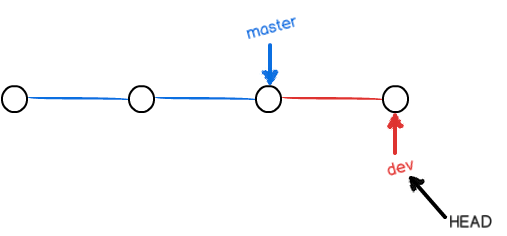
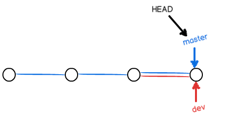
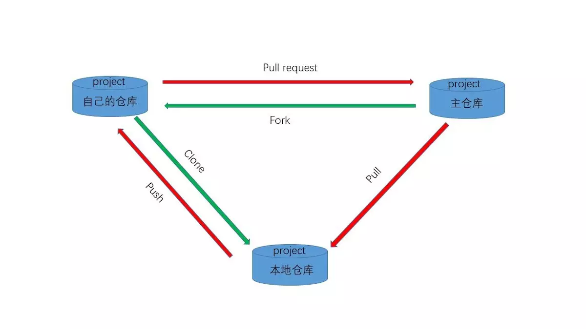
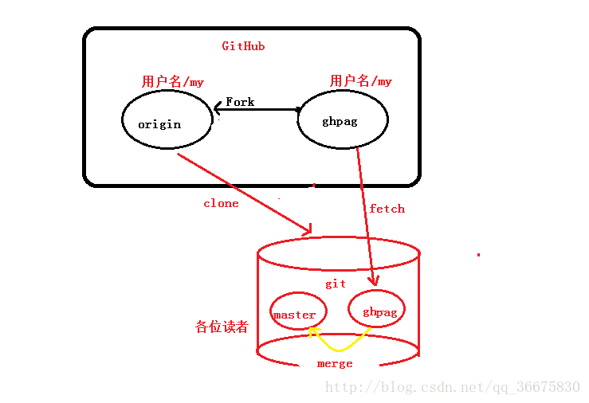

# 1. 类 Clss
`volume=Box1.getvolume()`
//`Box1`是`Class Box`的一个对象，`getvolume`是`Classs Box`的成员函数
调用成员函数实在对象上使用点运算符（.),这样就能操作与对象相关的数据和函数。

#2.std:share_ptr
`#include<memory>`share_ptr定义在memory头文件中.

**Example:**
`std:share_ptr<anydrive_ethercat::AnydriveManagerEthercat> anydriveManager`

**anydriveManager指向AnydriveManagerEthercat类，因此anydriveManager可以调用类的函数.**
`anydriveManager.reset(new anydrive_ethercat::AnydriveManagerEthercat(standalone, installSignalHandler, timeStep));`
`p.reset(new int(2014))`**P指向一个新对象**

#3.Typedef/  Typedef typename

##3.1Typedef: 类型别名

**简化类型的定义，别名**

`vector <list<int *>*>temp(10);`
可简化为：
`typedef list<int *> listnum;`
`typedef vector<listnum> *> vectornum;`
`vectornum temp(10);`

**声明结构体结构**
`typedef struct`
`{`
  `int month;`
  `int day;`
  `int year;`
  `}DATE;`
`DATE birthday;`//birthday是结构体变量.
**DATE是新类型名，不是结构体变量名**

##3.2 typedef typename
`template <class T>`
`void function()`
`{`
  `typedef typename T::A TA`//声明TA的类型是T：：A
  `TA a5`//声明a5的类型是TA
  `}`
**T只有末班实例化的时候才能知道其类型，所以编译器对T：：A不知所措，为了通知编译器T::A是一个合法的类型，使用typename语句可以避免编译器报错.**

#4. ROS::Time and Duration Class 依赖于roslib
**Time/Duration是为节点设置的模拟时钟.**

###4.1.Getting the Current timeStep
`ros::Time::now();`return time 0 until first message has been received.
`ros::Time begin = ros::Time::now();`

###4.2. Creating Time and Duration Instance.
`ros::Time a_little_after_the_beginning(0.001)`时间点；
`ros::Duration five_second(5.0)`时间段；
**a_little_after_the_beginning and five_second是类对象，括号内单位为秒**

###4.3. Converting Time and Duration Instance时间点和时间段之间的转化.
`double secs = ros::Time::now.toSec();`时间点转化为时间段，即多少秒.

###4.4 Sleeping and Rates
`ros::Duration(0.5).sleep();`//sleep for 0.5s.

#5. Thread
`boost::recursive_mutex`//用于保护共享数据免受从多个多线程同时访问.

###5.1 Lock__
这里的锁是动词而非名词，互斥对象的主要操作有两个加锁`lock`和释放锁`unlock`.
当一个线程对互斥对象进行`lock`操作并成功获得这个互斥对象的所有权，在此线程对此对象`unlock`前，其他线程对这个互斥对象的`lock`操作都会被阻塞.

#6. Github 基本操作

`git config user.name user.email`

**1.创建本地仓库**：
`git init` 把当前目录设置为Git可管理的仓库；
`git add readme.txt` 告诉Git,把文件添加到本地仓库；
`git commot -m "wrote a readme file"` 告诉Git，把文件提交到本地仓库；
**可以`git add`多个文件，最后一起`git commit`到本地仓库**。

**2.关联远程仓库**
`git remote add origin https://github.com/EricWang1hitsz/Eric_Note.git` 将本地仓库与远程仓库关联；

**本地仓库可以关联多个远程仓库，`orgin`为远程仓库名称，这个名字是随便取。**

`git push -u origin master` 将本地仓库的所有内容推送到远程仓库，注意是git commit的文件！
<kdb>-u<kdb>将本地master分支与远程master分支关联起来，在以后的推送和拉取就可以简化命令。

**3.推送与拉取**

`git pull`拉取；
`git add`--`git commit`--`git push origin master`推送；
**在本地仓库修改需要推送到远程仓库时，也需要执行<kdb>git add<kdb>。**

**4.Sign in to Github for Atom**

Your Github token:

``71e7f5ff5e904f66b7722a7ea6882d660896c6be``

LINK: https://github.atom.io/auth/github_package/token

**5.新建分支**

本地仓库新建分支，并将其推到远程仓库，在推送时远程仓库会自动建立：
````
git branch eric_wang_dev
git push -u origin eric_wang_dev
````
**6.切换分支**：

``git checkout eric_wang_dev``

分支查看：

``git branch -a`` 带*号的代表你当前工作目录所处的分支

**7.合并分支**

每次提交，Git都会将他们串成一条时间线，这条时间线就是一个分支、

合并前分支示意图：



合并后分支示意图：



分支合并：

``git merge eric_wang_dev``

将``eric_wang_dev``分支的内容合并到``master``分支上；

**8.合并冲突解决**

``git status``

查看目前仓库状态


# 7. New and Boost::share_ptr

````
RbPrmDevicePtr_t RbPrmDevice::create (const std::string& name, DevicePtr_t& robotRom)
{
    //eric_wang: typedef std::map<std::string, DevicePtr_t> T_Rom;
    hpp::model::T_Rom roms;
    roms.insert(std::make_pair(robotRom->name(),robotRom));

    //eric_wang: define a pointer object for class RbPrmDevice;
    //eric_wang: initialization the object with class constructor function;
    RbPrmDevice* rbprmDevice = new RbPrmDevice(name, roms);
    //eric_wang： boost::shared_ptr <RbPrmDevice> res (rbprmDevice);
    //eric_wang: create a pointer "res" pointing to the class object "rbprmDevice";
    RbPrmDevicePtr_t res (rbprmDevice);
    res->init (res);
    return res;
}

RbPrmDevicePtr_t RbPrmDevice::create (const std::string& name, const hpp::model::T_Rom &robotRoms)
{
    RbPrmDevice* rbprmDevice = new RbPrmDevice(name, robotRoms);
    RbPrmDevicePtr_t res (rbprmDevice);
    res->init (res);
    return res;
}
````

# 8. 动态数组

作用：一次性为数组中的很多元素分配内存；

``int *pia = new int [get_size()]``

new分配一个int类型数组，并返回指向第一个int数组元素的指针；

# 9. 指针

# 9.1 指针代替数组

在程序中使用指针代替数组，因为变量指针可以递增，而数组不能递增，因为数组是一个常量指针：

````
#include <iostream>

using namespace std;
const int MAX = 3;

int main ()
{
   int  var[MAX] = {10, 100, 200};
   int  *ptr;

   // 指针中的数组地址
   ptr = var;// 返回var数组的第一个元素的地址；
   for (int i = 0; i < MAX; i++)
   {
      cout << "Address of var[" << i << "] = ";
      cout << ptr << endl;

      cout << "Value of var[" << i << "] = ";
      cout << *ptr << endl;

      // 移动到下一个位置
      ptr++;//通过使用指针的算术运算来访问数组
   }
   return 0;
}

````
# 10. 在静态成员函数中访问非静态成员变量

在正常情况下，一个static修饰的静态成员函数是无法对非静态成员变量进行访问与操作的，因为访问非静态成员要用this指针，静态成员函数没有this指针，故不能访问。

**在静态成员函数中访问非静态成员变量方式：** 在静态成员函数中传递类的地址来实现对类对象的非静态成员变量进行访问与操作。

````
class example
{
public:

    static void fun1();

private:

int dollar;

};

void example::fun1()
{
    example* exam; // 创建class指针

    int money;

    money = exam->dollar; // 访问类的非静态成员变量
}
````
# 11. Github Pull Request

**1. 不同仓库之间的操作**



**2. Pull  Request一般流程：**

1. 首先Fork别人的项目，此时自己的远程仓库中有该项目；

2. 将该项目从自己的远程仓库Clone到本地；

3. 一般新建一个开发分支，在原有的基础上进行开发；

4. 对该项目添加新的功能后，此时将新建的分支提交到远程仓库；

5. **如果希望原有仓库采纳自己的新功能，此时需要Pull Request，打开GitHub，切换到刚创建的分支，进行New pull request；**

6. 当原有仓库持有人会收到你的请求信息，是非采纳。

**3. 仓库的维护：**

当原有仓库更新后，自己的本地仓库如何更新，保持与原有仓库同步的状态：

1. 关联原有仓库；

`git remote add 原有仓库名称 git:://github.com`//仓库链接

2. 将原有仓库下载到本地仓库；

`git fetch`

3. 合并分支

`git merge`


