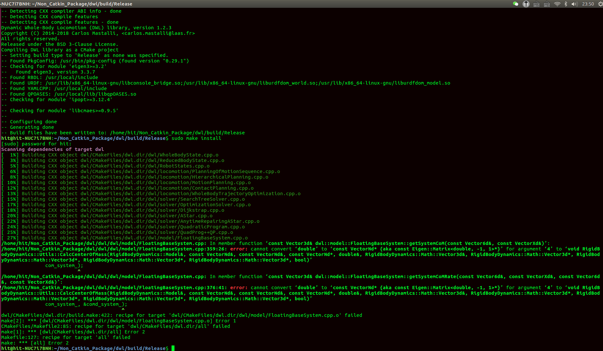

## 1.`undefined reference error`
**问题描述**：模板类的声明与实现分离实现，声明位于头文件中，实现位于源文件中，在类实例化时会出现`undefined reference to matrix<int>::matrix(int,int) `链接器报错，提示找不到模板；类的实现。
**解决方案**:在模板类实例化的文件中，将模板类实现.cpp文件include进来即可`#included "matrix_de.cpp"`

**模板类的声明与实现分离实现，连接器会报错；普通类不会报错**

https://blog.csdn.net/weixin_40539125/article/details/83375452

## 2. 读取文件绝对路径

`pcl::io::loadPCDFile("/home/hit/room_scan1.pcd",cloud)`

## 3. 函数形参实参匹配问题



终端错误显示强行把double转化为VectorNd,是因为C++将实参中mass赋值给了qddot.

因此，在不需要qddot值时，加个NULL使实参与形参正确匹配.

````
//Eric_wang: RBDL API Changed
//RBDL_DLLAPI void CalcCenterOfMass	(	Model & 	model,
//							const Math::VectorNd & 	q,
//							const Math::VectorNd & 	qdot,
//							const Math::VectorNd * 	qddot,
//							double & 	mass,
//							Math::Vector3d & 	com,
//							Math::Vector3d * 	com_velocity = NULL,
//							Math::Vector3d * 	com_acceleration = NULL,
//							Math::Vector3d * 	angular_momentum = NULL,
//							Math::Vector3d * 	change_of_angular_momentum = NULL,
//							bool 	update_kinematics = true
//							)

 const Eigen::Vector3d& FloatingBaseSystem::getSystemCoM(const rbd::Vector6d& base_pos,
 														const Eigen::VectorXd& joint_pos)
 {
 	Eigen::VectorXd q = toGeneralizedJointState(base_pos, joint_pos);
 	Eigen::VectorXd qd = Eigen::VectorXd::Zero(num_system_joints_);

 	double mass;
 	RigidBodyDynamics::Utils::CalcCenterOfMass(rbd_model_,
 											   q, qd, NULL, mass,
 											   com_system_);

 	return com_system_;
 }
````
