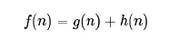

# 一、 动态规划

动态规划是解决多阶段决策过程最优化的一种数学方法；

## 1. 动态规划的本质
### 1.1 多阶段决策问题

多阶段决策过程，是指这样的一类特殊的活动过程，问题可以**按时间顺序或空间特征**分解成若干相互联系的阶段，在每一个阶段都要做出决策，全部过程的决策是一个决策序列。要使整个活动的总体效果达到最优的问题，称为**多阶段决策问题**。

### 1.2 阶段与状态

**阶段**：将所给问题的过程，按时间或空间特征分解成若干相互联系的阶段，以便按次序去求每阶段的解。常用字母k表示阶段变量;

**状态**: 各阶段开始时的客观条件叫做状态。描述各阶段状态的变量称为状态变量，常用sk表示第k阶段的状态变量，状态变量sk的取值集合称为状态集合，用Sk表示;

**阶段之间是通过状态和状态转移来相互联系的。**

### 1.3 决策和策略

**决策**：当各段的状态取定以后，就可以做出不同的决定，从而确定下一阶段的状态，这种决定称为决策。表示决策的变量，称为决策变量，常用uk(sk)表示第k阶段当状态为sk时的决策变量。

**决策目的是确定下一阶段的状态，有了决策，就可以定义状态转移。动态规划中本阶段的状态往往是上一阶段和上一阶段的决策结果，由第k段的状态sk和本阶段的决策uk确定第k+1段的状态sk+1的过程叫状态转移。状态转移规律的形式化表示sk+1=Tk(sk,uk)称为状态转移方程。**

**策略**：各段决策确定后，整个问题的决策序列就构成了一个策略。

### 1.4 最优指标函数和规划方程

**最优指标函数**：用于衡量所选定策略优劣的数量指标称为指标函数，最优指标函数记为fk(sk)，它表示**从第k段状态sk采用最优策略$p_{nk}^* $ 到过程终止时的最佳效益值**;

**规划方程**： 最优指标函数的求法一般是一个从目标状态出发的递推公式，称为规划方程；

$f_k(s_k) = opt_{u_k\in D_k(s_k)}g(f_{k+1}(T_k(s_k,u_k)),u_k)$

其中$s_k$是第$k$段的某个状态，$u_k$是从$s_k$出发的允许决策集合$D_k(s_k)$中的一个决策，$T_k(s_k,u_k)$是由$s_k$和$u_k$所导出的第$k+1$段的某个状态$s_{k+1}$，$g(x,u_k)$是定义在数值$x$和决策$u_k$上的一个函数，而函数$opt$表示最优化，根据具体问题分别表为$max$或$min$, $f_n（s_n) =$ 某个初始值，称为**边界条件**。


## 2. 动态优化的优点

# 二、 运动规划

## 1. A* 算法

https://www.jianshu.com/p/a3951ce7574d

A*算法通过下面这个函数来计算每个节点的优先级：



其中：

f(n)是节点n的综合优先级。当我们选择下一个要遍历的节点时，我们总会选取综合优先级最高（值最小）的节点。

g(n) 是节点n距离起点的代价。

h(n)是节点n距离终点的预计代价，这也就是A*算法的启发函数。

另外，A*算法使用两个集合来表示待遍历的节点，与已经遍历过的节点，这通常称之为``open_set``和``close_set``。

````
* 初始化open_set和close_set；
* 将终点加入open_set中，并设置优先级为0（优先级最高）；
* 如果open_set不为空，则从open_set中选取优先级最高的节点n：
    * 如果节点n为终点，则：
        * 从终点开始逐步追踪parent节点，一直达到起点；
        * 返回找到的结果路径，算法结束；
    * 如果节点n不是终点，则：
        * 将节点n从open_set中删除，并加入close_set中；
        * 遍历节点n所有的邻近节点：
            * 如果邻近节点m在close_set中，则：
                * 跳过，选取下一个邻近节点
            * 如果邻近节点m也不在open_set中，则：
                * 设置节点m的parent为节点n
                * 计算节点m的优先级
                * 将节点m加入open_set中
````

**启发函数:**

在极端情况下，当启发函数h(n)始终为0，则将由g(n)决定节点的优先级，此时算法就退化成了Dijkstra算法。

如果h(n)始终小于等于节点n到终点的代价，则A*算法保证一定能够找到最短路径。但是当h(n)的值越小，算法将遍历越多的节点，也就导致算法越慢。

如果h(n)完全等于节点n到终点的代价，则A*算法将找到最佳路径，并且速度很快。可惜的是，并非所有场景下都能做到这一点。因为在没有达到终点之前，我们很难确切算出距离终点还有多远。

如果h(n)的值比节点n到终点的代价要大，则A*算法不能保证找到最短路径，不过此时会很快。

在另外一个极端情况下，如果h()n相较于g(n)大很多，则此时只有h(n)产生效果，这也就变成了最佳优先搜索。

**通过调节启发函数我们可以控制算法的速度和精确度**

#### 1.1 A* 衍生算法

[1] ARA*, Anytime Repairing A
[2] D*, Dynamic A
[3] Field D*
[4] Block A*

## 2. ARA* 算法
