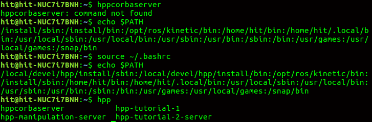

# 1.Terminator is not working and disappear immediately

**solution**: reinstall the Terminator

remove the terminator purgely

`sudo apt-get purge terminator`

delete the configuration files loacated in your home directory

`sudo rm -rfvI /home/.config/terminator`

after that, install it again

`sudo apt-get install terminator`

 **plz remember to remove the configuration file, or you will install unsuccessfully.**

 **source**:https://unix.stackexchange.com/questions/212417/terminator-is-not-working

# 2. ANYDrive

`any_worker::Worker`worker=trajectory

`standalone=true`worker被实例化，每隔一定时间回调`update()`

`Work(name,timestep,callback)`调用指向callback的函数,即Worker调用某函数

` bool loadSetup(const std::string& setupFile = "")`加载配置文件，绝对路径

` bool loadSetup(const setup::SetupPtr& setup);`加载配置参数

`update()`

`timestamp`时间戳是自 1970 年 1 月 1 日（08:00:00 GMT）至当前时间的总秒数

`updateworkCb`Worker updating the ANYdrive Manager if standalone is true. the update work calls

 "updateworkCb" at a frequency of "1.0/timestep"

## PROMBLE DESCRIPTION

## anydrive

在编译`anydrive_trajectory_ros`时，

出现`any_measurementconfig.cmake`错误时，

**需要安装**

`sudo apt install ros-kinetic-anydrive-ethercat-ros ros-kinetic-rqt-anydrive-monitor
`
**添加源**

`http://packages.leggedrobotics.com/anydrive/ubuntu/xenial main`

## root 硬件链接

`[ERROR] [eno1] No socket connection. Execute as root.

[ERROR] Failed to startup bus 'eno1'.

[ERROR] [1554375926.324282108]: ANYdrive Manager could not be started.
`
**错误提示：Execute as root**.

**解决方法：`sudo su`获取权限，与硬件连接，一般都需要root权限**

**在获得root权限和退出root权限后，都需要更新下环境变量`source devel/setup.bash`**

# 3. CMakelist.txt
**可执行目标**要指定必须构建的可执行目标，我们必须使用`add_executable()`函数

`add_executable(myProgram src/main.cpp src/file1.cpp src/file2.cpp)`

这将构建一个名为myProgram的目标可执行文件，它由3个源文件构建：src/main.cpp,src/file1.cpp,src/file2.cpp.**注意

格式!!!**

**创建package时，在QT编译后，看不到src/packages_name，这时需要该改写CMakelist.txt文件.**

**Build**

**Specify additional locations of header files and your own package location should be listed before other locations**

`include_directories`

`include`//your own package

`${catkin_INCLUDE_DIRS}`


# 4. roslaunch / 启动文件launch file.

**当查找启动文件时，roslaunch工具会同时搜索每个功能包目录的子目录.**

### 启动文件的基本元素

**1.插入根元素** 启动文件是XML文件，每个XML文件都必须要包含一个根元素.对于ROS启动文件，根元素由一对launch标签定义：
`                    <launch>`
`                      ...`
`                    </launch>`
每个启动文件的其他元素都应该包含在这两个标签之内.

**2.启动节点**  任何启动文件的核心都是一系列的节点元素，每个节点元素指向一个需要启动的节点.节点元素的形式：

`<node`

`pkg="package-name"`

`type="executable-name"`

`name="node-name"`

`/>`

`pkg`与`type`定义了ROS应该运行哪个程序来启动这个节点，和`rosrun`的两个命令行参数的作用是一致的，即给出功能包名和可执行文件的名称.

`name`给节点指派了名称，将覆盖任何通过调用`ros init`来赋予节点的名称.

`output="screen"`只需在单个节点元素中配置output属性，即可在控制台中输出信息，而不是记录到日志文档，显示`ROS INFO("")`信息.

同时，`roslaunch -screen package-name launch-file-name`命令可实现在控制台中显示所有节点的输出.

**3. 请求复位**

在启动了启动文件中所有的请求节点之后,`roslaunch`会监视每一个节点,记录哪一个节点是活跃的。对于每个节点,我们可以设置`respawn`属性为真,这样当节点停止的时候,roslaunch 会重新启动该节点.

`respawn="ture"`

**这个功能是有意义的,比如在某个节点因为软件崩溃或硬件故障以及其他原因导致过早退出系统的时候会起到作用.**

**4. 必要节点**

复位之外的另一种策略是讲一个节点声明为必要节点.

`required="true"`

当一个必要节点终止的时候,roslaunch 会终止所有其他活跃节点并退出.

**由于`respawn`和`required`二者的作用是相互矛盾的,因此,如果对一个节点同时配置了这两种属性,`roslaunch`会报错.**

**5. 为节点维护独立的窗口**

当某节点需要向控制台输入指令时，该节点需要一个独立的终端

`launch-prefix="xetrm-e"`单独打开一个终端，运行节点.

### 启动文件的启动参数args

**优点：通过设置参数来描述节点在不同ROS会话中运行时可能需要改变的一小部分，从而避免代码重复**

**1.声明参数**

`<arg name="arg-name">`

**2.参数赋值**

*命令行赋值:*`roslaunch package-name launch-file-name arg-name:=arg-value`

*启动文件赋值：*`<arg name="arg-name" default="arg-value"/>`//默认值

`<arg name="arg-name" value="arg-value"/>`//参数值

**通过命令行赋值，可以覆盖启动文件中的默认值default,但不能覆盖参数值value，否则会产生错误**

**3.获取参数值**

一旦参数值被声明并且被赋值后，就可以利用替换语法来使用该参数值.

`$(arg arg-name)`

**EXAMPLE:**

*声明以及赋值:*`<arg name="time_step" default=:"0.001"/>`

*参数获取:*`param name=:"time_step" value="$(arg time_step)"/>`

# 5. `/configure、make、make install`命令`

**1. `./configure`**

一般用来生成`Makefile`，为下一步的编译做准备，在`configure`后加上参数可以对安装进行控制.


**2.`make`编译**
对源代码进行编译，如果出现找不到`Makefile`的错误时，需要先`./configre`一下，再`make`.

**3.`make install`编译安装**

类似与`windows`下安装软件，安装路径等参数在`./configre`时可以设置,执行这一步时，一般都需要root权限，因为要向系统写入文件.

# 6. 安装deb包缺少依赖解决办法

`sudo dpkg -i xxx.deb`//缺少大量依赖；

`sudo apt-get update`

`sudo apt-get -f install`

`sudo dpkg -i xxx.deb`//重新安装即可；

# 7. Octomap_rviz_plugins安装方法

**Link**:https://stackoverflow.com/questions/56687742/how-to-add-octomap-rviz-plugins-to-rviz

`cd octomap_rviz_plugins`

`mkdir build`

`cd build`

`cmake ..`

`make`

`sudo make install`


需安装到Catkin Workspace中才可生效。

# 8. chmod设置权限

**Link**:https://www.runoob.com/linux/linux-comm-chmod.html

在打开可执行文件、USB等需要赋予权限。

# 9. Rviz Fixed Frame设置

**在使用Rviz时，如果不设置Fix_Frame,则无法显示相应的数据信息**

The fixed frame is the reference frame used to denote the "world" frame. This is the usually the "map", or "wrold".

如果显示不了topic的数据信息，解决方法:

`rosrun tf static_transform_publisher 0 0 0 0 0 0 map xxx 100`;xxx = your own frame;

**用tf包工具发布Global Fixed Frame到Topic所在坐标系的tf关系**

# 10. Ubuntu终端输入./configure

在Linux中.表示当前目录，./configure表示执行当前目录下的configure文件，如果当前目录下没有configure文件，则提示no such file。一般的开源的软件，下载完源代码，解压，在解压后的目录下会有configure文件，执行完./confiugre后，会生成Makefile文件，再执行make即开始编译，最后执行make install将编译后的文件安装到系统中。

# 11. 脚本文件/可执行文件运行


终端输入：``脚本文件名称.sh``或``可执行文件名称``,这种情况是在此时``$PATH``上列出的路径查找该文件，不会查询当前的目录有没有此文件；

终端输入：``./脚本文件名称.sh``或``可执行文件名称``，这种情况在当前的目录下查找该文件；




# 12. 删掉安装到系统的库

在执行完``make install``后会在``build``目录下生成
个``install_manifest.tx``t文件，该文件里保存了库和头文件所安装的位置

``xargs rm < install_manifest.txt``

执行该命令，即可删除库，但保存了文件夹。

# 13. rviz

``2D Nav Goal:``set a goal sent on the "/move_base_simple/goal" ROS topic;

``2D Pose Estimate:``set an initial pose to the location system (sent on the "/initialpose" ROS topic);

``Publish Point:`` sent a <geometry_msgs::PointStamped> point on the "/clicked_point" ROS topic;

# 14. 删除文件夹

``sudo rm -rf $directory_name``

# 15. ROS Subscriber
````
class pcl_filter
{
public:
    //constructor function
    pcl_filter()
    {
        cloud_sub = nh_.subscribe<sensor_msgs::PointCloud2>("/camera/depth/points", 1, &pcl_filter::pointcloud_filter_cb, this);

    }

    void pointcloud_filter_cb(const sensor_msgs::PointCloud2::ConstPtr &msg)
    {
        pcl::PointCloud<pcl::PointXYZRGB> cloud;
        pcl::fromROSMsg(*msg, cloud);
    }


private:

    ros::Subscriber cloud_sub;
    ros::NodeHandle nh_;
};
````
