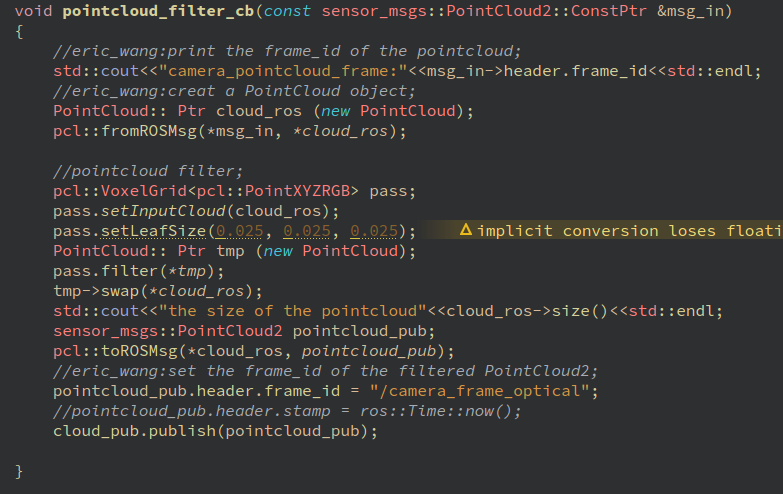
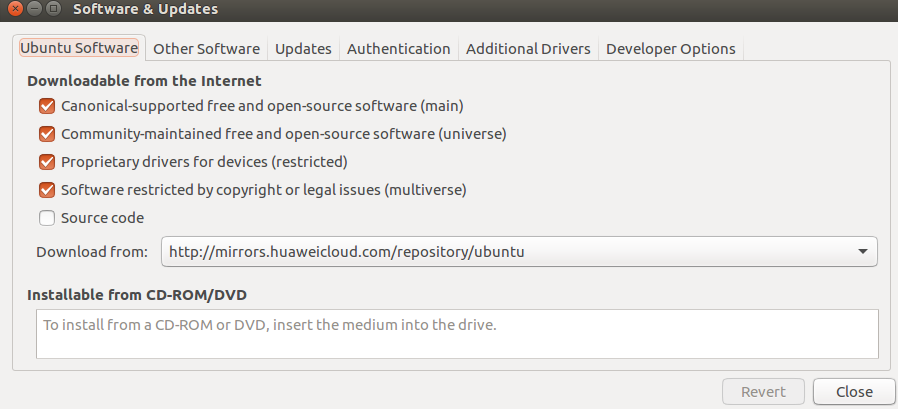
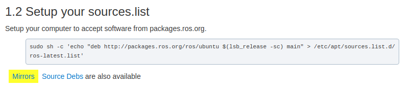

# 1.Terminator is not working and disappear immediately

**solution**: reinstall the Terminator

remove the terminator purgely

`sudo apt-get purge terminator`

delete the configuration files loacated in your home directory
`sudo rm -rfvI /home/.config/terminator`

after that, install it again

`sudo apt-get install terminator`

 **plz remember to remove the configuration file, or you will install unsuccessfully.**

 **source**:https://unix.stackexchange.com/questions/212417/terminator-is-not-working

# 2. ANYDrive

`any_worker::Worker`worker=trajectory

`standalone=true`worker被实例化，每隔一定时间回调`update()`

`Work(name,timestep,callback)`调用指向callback的函数,即Worker调用某函数

` bool loadSetup(const std::string& setupFile = "")`加载配置文件，绝对路径

` bool loadSetup(const setup::SetupPtr& setup);`加载配置参数

`update()`

`timestamp`时间戳是自 1970 年 1 月 1 日（08:00:00 GMT）至当前时间的总秒数

`updateworkCb`Worker updating the ANYdrive Manager if standalone is true. the update work calls

 "updateworkCb" at a frequency of "1.0/timestep"

## PROMBLE DESCRIPTION

## anydrive

在编译`anydrive_trajectory_ros`时，

出现`any_measurementconfig.cmake`错误时，

**需要安装**

`sudo apt install ros-kinetic-anydrive-ethercat-ros ros-kinetic-rqt-anydrive-monitor
`
**添加源**

`http://packages.leggedrobotics.com/anydrive/ubuntu/xenial main`

## root 硬件链接

`[ERROR] [eno1] No socket connection. Execute as root.

[ERROR] Failed to startup bus 'eno1'.

[ERROR] [1554375926.324282108]: ANYdrive Manager could not be started.
`
**错误提示：Execute as root**.

**解决方法：`sudo su`获取权限，与硬件连接，一般都需要root权限**

**在获得root权限和退出root权限后，都需要更新下环境变量`source devel/setup.bash`**

# 3. CMakelist.txt
**可执行目标**要指定必须构建的可执行目标，我们必须使用`add_executable()`函数

`add_executable(myProgram src/main.cpp src/file1.cpp src/file2.cpp)`

这将构建一个名为myProgram的目标可执行文件，它由3个源文件构建：src/main.cpp,src/file1.cpp,src/file2.cpp.**注意

格式!!!**

**创建package时，在QT编译后，看不到src/packages_name，这时需要该改写CMakelist.txt文件.**

**Build**

**Specify additional locations of header files and your own package location should be listed before other locations**

`include_directories`

`include`//your own package

`${catkin_INCLUDE_DIRS}`


# 4. roslaunch / 启动文件launch file.

**当查找启动文件时，roslaunch工具会同时搜索每个功能包目录的子目录.**

### 1. 启动文件的基本元素

**1.插入根元素** 启动文件是XML文件，每个XML文件都必须要包含一个根元素.对于ROS启动文件，根元素由一对launch标签定义：
`                    <launch>`
`                      ...`
`                    </launch>`
每个启动文件的其他元素都应该包含在这两个标签之内.

**2.启动节点**  任何启动文件的核心都是一系列的节点元素，每个节点元素指向一个需要启动的节点.节点元素的形式：

`<node`

`pkg="package-name"`

`type="executable-name"`

`name="node-name"`

`/>`

`pkg`与`type`定义了ROS应该运行哪个程序来启动这个节点，和`rosrun`的两个命令行参数的作用是一致的，即给出功能包名和可执行文件的名称.

`name`给节点指派了名称，将覆盖任何通过调用`ros init`来赋予节点的名称.

`output="screen"`只需在单个节点元素中配置output属性，即可在控制台中输出信息，而不是记录到日志文档，显示`ROS INFO("")`信息.

同时，`roslaunch -screen package-name launch-file-name`命令可实现在控制台中显示所有节点的输出.

**3. 请求复位**

在启动了启动文件中所有的请求节点之后,`roslaunch`会监视每一个节点,记录哪一个节点是活跃的。对于每个节点,我们可以设置`respawn`属性为真,这样当节点停止的时候,roslaunch 会重新启动该节点.

`respawn="ture"`

**这个功能是有意义的,比如在某个节点因为软件崩溃或硬件故障以及其他原因导致过早退出系统的时候会起到作用.**

**4. 必要节点**

复位之外的另一种策略是讲一个节点声明为必要节点.

`required="true"`

当一个必要节点终止的时候,roslaunch 会终止所有其他活跃节点并退出.

**由于`respawn`和`required`二者的作用是相互矛盾的,因此,如果对一个节点同时配置了这两种属性,`roslaunch`会报错.**

**5. 为节点维护独立的窗口**

当某节点需要向控制台输入指令时，该节点需要一个独立的终端

`launch-prefix="xetrm-e"`单独打开一个终端，运行节点.

### 2. 启动文件的启动参数args

**优点：通过设置参数来描述节点在不同ROS会话中运行时可能需要改变的一小部分，从而避免代码重复**

**1.声明参数**

`<arg name="arg-name">`

**2.参数赋值**

*命令行赋值:*`roslaunch package-name launch-file-name arg-name:=arg-value`

*启动文件赋值：*`<arg name="arg-name" default="arg-value"/>`//默认值

`<arg name="arg-name" value="arg-value"/>`//参数值

**通过命令行赋值，可以覆盖启动文件中的默认值default,但不能覆盖参数值value，否则会产生错误**

**3.获取参数值**

一旦参数值被声明并且被赋值后，就可以利用替换语法来使用该参数值.

`$(arg arg-name)`

**EXAMPLE:**

*声明以及赋值:*`<arg name="time_step" default=:"0.001"/>`

*参数获取:*`param name=:"time_step" value="$(arg time_step)"/>`

### 3. 启动文件中的参数设置Param

**1.设置参数**
````
<param name="/free_gait/robot_description" value="$(find quadruped_model)/urdf/simpledog.urdf"/>
<param name="/free_gait/stop_execution_service" value="/free_gait/stop_execution_service"/>
````
**2.设置私有参数**

在节点元素中包含Param元素：
````
<node>
<param name="param-name" value="param-value" />
</node>
````
**3.在文件中读取参数**

可以一次性从文件中加载多个参数：

``<rosparam command="load" file="path-to-param-file" />``

# 5. `/configure、make、make install`命令`

**1. `./configure`**

一般用来生成`Makefile`，为下一步的编译做准备，在`configure`后加上参数可以对安装进行控制.


**2.`make`编译**
对源代码进行编译，如果出现找不到`Makefile`的错误时，需要先`./configre`一下，再`make`.

**3.`make install`编译安装**

类似与`windows`下安装软件，安装路径等参数在`./configre`时可以设置,执行这一步时，一般都需要root权限，因为要向系统写入文件.


# 6. 安装deb包缺少依赖解决办法

`sudo dpkg -i xxx.deb`//缺少大量依赖；

`sudo apt-get update`

`sudo apt-get -f install`

`sudo dpkg -i xxx.deb`//重新安装即可；

# 7. Octomap_rviz_plugins安装方法

**Link**:https://stackoverflow.com/questions/56687742/how-to-add-octomap-rviz-plugins-to-rviz

`cd octomap_rviz_plugins`

`mkdir build`

`cd build`

`cmake ..`

`make`

`sudo make install`


需安装到Catkin Workspace中才可生效。

# 8. chmod设置权限

**Link**:https://www.runoob.com/linux/linux-comm-chmod.html

在打开可执行文件、USB等需要赋予权限。

# 9. Rviz Fixed Frame设置

**在使用Rviz时，如果不设置Fix_Frame,则无法显示相应的数据信息**

The fixed frame is the reference frame used to denote the "world" frame. This is the usually the "map", or "wrold".

如果显示不了topic的数据信息，解决方法:

`rosrun tf static_transform_publisher 0 0 0 0 0 0 map xxx 100`;xxx = your own frame;

**用tf包工具发布Global Fixed Frame到Topic所在坐标系的tf关系**

# 10. Ubuntu终端输入./configure

在Linux中.表示当前目录，./configure表示执行当前目录下的configure文件，如果当前目录下没有configure文件，则提示no such file。一般的开源的软件，下载完源代码，解压，在解压后的目录下会有configure文件，执行完./confiugre后，会生成Makefile文件，再执行make即开始编译，最后执行make install将编译后的文件安装到系统中。

# 11. 脚本文件/可执行文件运行


终端输入：``脚本文件名称.sh``或``可执行文件名称``,这种情况是在此时``$PATH``上列出的路径查找该文件，不会查询当前的目录有没有此文件；

终端输入：``./脚本文件名称.sh``或``可执行文件名称``，这种情况在当前的目录下查找该文件；


# 12. 删掉安装到系统的库

在执行完``make install``后会在``build``目录下生成
个``install_manifest.tx``t文件，该文件里保存了库和头文件所安装的位置

``xargs rm < install_manifest.txt``

执行该命令，即可删除库，但保存了文件夹。

# 13. rviz

``2D Nav Goal:``set a goal sent on the "/move_base_simple/goal" ROS topic;

``2D Pose Estimate:``set an initial pose to the location system (sent on the "/initialpose" ROS topic);

``Publish Point:`` sent a <geometry_msgs::PointStamped> point on the "/clicked_point" ROS topic;

# 14. 删除文件夹

``sudo rm -rf $directory_name``

# 15. ROS Publisher Subscriber
````
class pcl_filter
{
public:
    //constructor function
    pcl_filter()
    {
        cloud_sub = nh_.subscribe<sensor_msgs::PointCloud2>("/camera/depth/points", 1, &pcl_filter::pointcloud_filter_cb, this);

    }

    void pointcloud_filter_cb(const sensor_msgs::PointCloud2::ConstPtr &msg)
    {
        pcl::PointCloud<pcl::PointXYZRGB> cloud;
        pcl::fromROSMsg(*msg, cloud);
    }


private:

    ros::Subscriber cloud_sub;
    ros::NodeHandle nh_;
};
````
**发布者**：

`advertise()`最后的参数是一个整数，表示这个发布者发布的消息序列的大小。

`pub.pulish(msg)`将所给的消息添加到发布者的输出消息队列中，在后台有一个单独的线程负责实际发送消息到话题Toptic。

如果`pub.publish(msg)`发布比队列可以容纳更多的消息，最早进入队列的未发送到订阅者的消息将被丢弃。

`ros::Rate rate(2)`控制循环运行速度，没有这种控制，计算机会以最快速度发布消息。

`min: 0.500s max:0.500s std dev: 0.00006s window:10`可看出消息以每秒2条的速度发布，且时间上偏差非常小。


**订阅者**：

当新的消息到达时，它们会被保存在一个队列中，直到ROS去执行相应的回调函数。如果新消息到达时队列已满,最早到达的还没有被处理的消息将会被丢弃以便腾出空间来。

对于有些传输特别快的消息，尤其需要注意合理控制消息池大小和ros::spinOnce()执行频率; 比如消息送达频率为10Hz, ros::spinOnce()的调用频率为5Hz，那么消息池的大小就一定要大于2，才能保证数据不丢失，无延迟。

````
int main(int argc, char **argv)
{
    ros::init(argc, argv, "listener");
    ros::NodeHandle n;
    ros::Subscriber sub = n.subscribe("chatter", 2, chatterCallback);
    //在一次阶段循环中，调用一次回调函数，得到两个消息；

    ros::Rate loop_rate(5);
    while (ros::ok())
    {
        /*...TODO...*/

        ros::spinOnce();
        loop_rate.sleep();
    }
    return 0;
}
````
参考：https://www.cnblogs.com/liu-fa/p/5925381.html

**Attention: 在订阅某话题时，也会向Master注册此话题，即使没有此话题的发布者，在rostopic list会显示该话题**

# 16. kinetic: /camera/depth/points Frame_id

在gazebo中，kinetic生成的点云(``topic:/camera/depth/points``)位于坐标系``/camera_frame_optical``下；

方法：订阅该话题，打印出点云的Frame_id;


**点云过滤**

过滤后的新点云的Frame_id设为与原来点云相同，即坐标系``/camera_frame_optical``：



**点云转化为八叉树**

生成的八叉树地图Frame_id可以选择为``/odom``,不必与点云坐标相同； **WHY?????? 2019.09.19**

# 17. 链接库失败

如果定义库路径失败，可以试一试直接定义链接到so文件；

# 18. Velodyne /Laser Radar

在仿真中，激光雷达发布的消息类型:
``sensor_msgs/PointCloud2``:

````
hit@hit-NUC7i7BNH:~/catkin_ws$ rostopic type /velodyne_points
sensor_msgs/PointCloud2
````
插件频率设置为10Hz,但实际频率只有1Hz：
````
rostopic hz /velodyne_points
````

# 19. Unbuntu + ROS 源

Ubuntu Software 对应于ubuntu源，Other Software 对应于ROS源；



/etc/apt/source.list文件加载Ros源， `Reload`相当于`sudo apt-get update`；




在安装ROS教程中，该命令是加载ROS官方源，但较慢；`Mirrors`这里有不同国家的**ROS源**;

# 20. Time / Timestamp

1. 仿真时间`simulation time`: Toptic `/clock` publish "simulation time";

2. 系统时间`wall-time`：use the computer's system clock as a time source;

3. 在多机使用ROS时，需要同步两个设备的系统时间（wall-clock time），使用工具ntp(The Network Time Protocol), chrony. **如果不同步的话，会引起tf问题。** 同步时间： `sudo ntpdate IP`


4. `use_sim_time`: In order for a ROS node to use simulation time according to the /clock topic, the /use_sim_time parameter must be set to true before the node is initialized. This can be done in a launchfile or from the command line.

5. `Rviz: Ros Time`: it allows you to see how much ROS Time time has passed, vs. how much "Wall Clock" (aka real) time has passed.以电脑系统时间为计算点。TODO: `Reset`什么功能？？？？

# 21. 多ROS设备时间同步

CSDN Blog:
https://blog.csdn.net/weixin_39374743/article/details/103097742

# 21. ros::spin()与ros::spinOnce()

**用途**：节点进入循环状态，当有订阅的消息到达，会调用回调函数，若没有消息到达，则不会调用回调函数。

**区别**：

`ros::spinOnce()`要求ROS去执行所有挂起的回调函数，然后将控制权返回给我们；

`ros::spin()`要求ROS等待并执行回调函数，直到这个节点关闭；

`ros::spin()`相当于这样一个循环：
````
while(ros::ok())
{
  ros::spinOnce();
}
````

**选择**: 如果程序里除了响应回调函数，还有其他重复性工作要做，那么使用`ros::spinOnce()`,具体做法写一个循环，做其他事情，并且周期性地调用`ros::spinOnce()`来处理回调。

**在程序中，如果忽略调用`ros::spin()`与`ros::spinOnce()`，在这种情况下，ROS永远不会执行你的回调函数。**

参考1： https://blog.csdn.net/hzy925/article/details/79373403

参考2：https://www.cnblogs.com/liu-fa/p/5925381.html

# 22. CMake指定编译顺序
在生成ros message, 其他package依赖此message,往往会报没有找到message头文件的错误，这是因为在编译此package之前没有编译生成message，因此在cmakelist添加
```
add_dependencies(package_node ${${PROJECT_NAME}_EXPORTED_TARGETS})
```
http://wiki.ros.org/catkin/CMakeLists.txt
