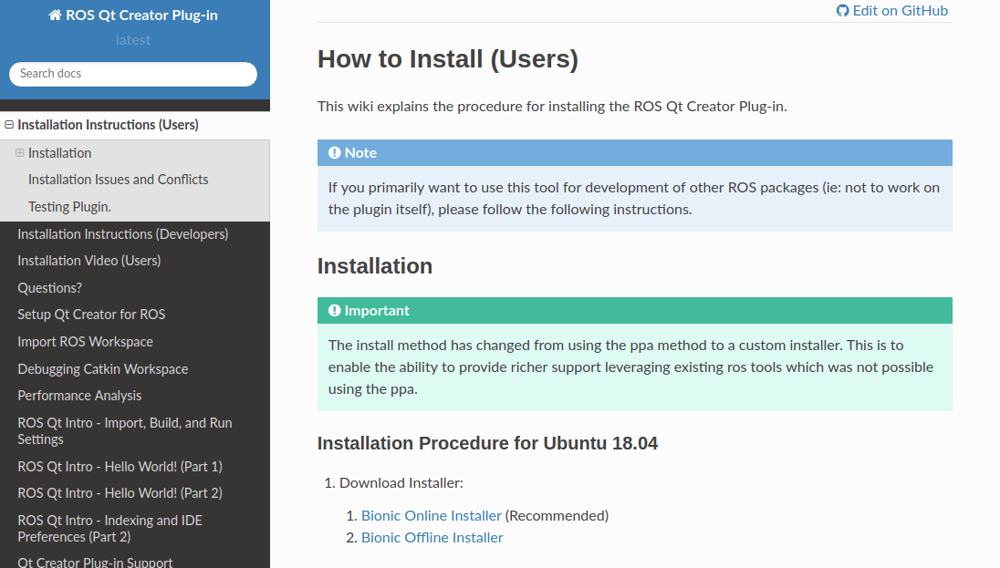

## 1. <kdb>ATOM<kdb>

### Package Download: https://atom.io/

### Plugin Markdown-preview-enhanced:

翻墙情况：可以在Atom Package直接安装；

无法翻墙情况下：https://blog.csdn.net/Move_now/article/details/71512014

Github： https://github.com/shd101wyy/markdown-preview-enhanced

## 2. QT with Ros Plugin



- Installation Instruction(Users).

- Download Installer, recommend that Xenial Offine Installer.

- Follow QT installer Procedure.

- Link:https://ros-qtc-plugin.readthedocs.io/en/latest/_source/How-to-Install-Users.html#installation-procedure-for-ubuntu-16-04

## 3. Tencent

- **Deep-wine-ubuntu Install**

```
git clone https://github.com/wszqkzqk/deepin-wine-ubuntu.git
sudo ./install.sh
```
- **Wechat Install**

Download deb Package firstly

Then `sudo dpkg -i xxx.deb`

Link:https://github.com/wszqkzqk/deepin-wine-ubuntu

## 4. Vscode + Leetcode刷题神器

Nodejs8+环境配置：
https://blog.csdn.net/cgs1999/article/details/89703649

改为中国区，邮箱登录；
